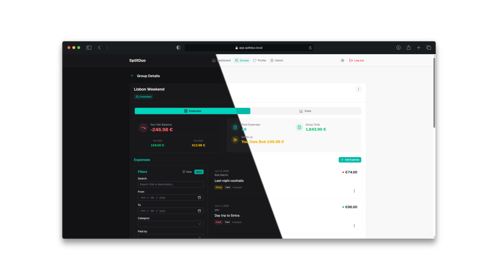

<p align="center">
  
</p>

# SplitDuo

[](https://gitlab.com/j1mm0/splitduo/-/pipelines)
[](https://gitlab.com/j1mm0/splitduo/-/graphs/main/charts)
[](https://gitlab.com/j1mm0/splitduo/-/releases)

**Primary repo:** [gitlab.com/j1mm0/splitduo](https://gitlab.com/j1mm0/splitduo) · **GitHub mirror:** [github.com/c4mbr0nn3/splitduo](https://github.com/c4mbr0nn3/splitduo) — development, issues, and releases happen on GitLab; GitHub is kept in sync for visibility and stars.

Shared finances, without the noise. SplitDuo is a self-hosted expense splitting app for small groups — couples, housemates, travel companions, or anyone sharing costs. No subscription, no third-party servers, no data you don't control.

A focused alternative to Splitwise and Cospend, deployable in one `docker compose up`.

## Tech Stack

| Layer      | Technology                                  |
| ---------- | ------------------------------------------- |
| Backend    | .NET 10, Entity Framework Core 10           |
| Frontend   | Vue 3, Nuxt 4, Nuxt UI v4, TailwindCSS v4   |
| Database   | PostgreSQL 17                               |
| Deployment | Single Docker container (multi-stage build) |

The frontend is compiled to static files and served directly by the .NET backend — one container, one port, no reverse proxy needed.

---



---

## Features

**Expense tracking that stays out of your way**
Add expenses, pick a split, move on. SplitDuo handles the arithmetic — proportional splits, unequal amounts, custom breakdowns — and keeps a live balance so everyone always knows where they stand.

**Settlement-aware balances**
Rather than a raw transaction log, SplitDuo computes net balances across the whole group and surfaces clear settlement suggestions — minimizing the number of transfers needed to settle up.

**Alias mode for subgroup splitting**
For groups where members act as sub-units (a couple sharing one slot, a household treated as one), turn on alias mode at creation. Members are grouped into named aliases and expenses split by subgroup instead of by person. Balances settle at the alias level.

**AI-powered receipt scanning**
Point your camera at a receipt and SplitDuo prefills the amount, date, and category. Works with any OpenAI-compatible endpoint — bring your own key, keep your data local.

**Mobile-first, installable**
The interface is designed for a phone screen first. Add it to your home screen as a PWA and it behaves like a native app — no app store required.

**Invite by email**
Add your partner via a secure, time-limited invitation link. No account needed on their end until they accept.

**Data portability**
Import existing data from Cospend, Splitwise, or a SplitDuo CSV export. Alias-mode groups use a dedicated three-section CSV format. Export at any time. No lock-in.

**Two-factor authentication**
Each user can independently enable TOTP-based 2FA on their account, with backup codes for recovery.

**Group stats with charts**
Per-group dashboard with category, monthly, and per-member breakdowns to see where money goes over time.

**Internationalization**
Full UI translation (English and Italian) with per-user language preference. Locale parity is enforced at build time.

**Admin panel**
User management with role-based access — promote users, reset passwords, manage invitations.

**Fully self-hosted**
Single Docker container. Your server, your database, your rules.

---

## Quick Start

Requires Docker and Docker Compose. The app image is published on [Docker Hub](https://hub.docker.com/r/j1mm0/splitduo) — no build step needed.

```bash
git clone https://gitlab.com/j1mm0/splitduo.git
cd splitduo
docker compose up -d
```

Open `http://localhost:3000` — default login is `admin@splitduo.local` / `changeme123`.

> **Before going to production**: set `SD_JWT_SECRET_KEY` and `SD_INITIAL_USER_PASSWORD` to something you control. See the [self-hosting guide](docs/self-hosting.md) for the full walkthrough.

---

## Documentation

### Setup & Operations

- [Self-Hosting with Docker](docs/self-hosting.md) — deploy in 5 minutes
- [Configuration](docs/readme/configuration.md) — environment variables reference
- [Development](docs/readme/development.md) — local dev setup, migrations, dev services
- [Testing](docs/readme/testing.md) — integration, unit, and frontend tests, coverage
- [Releasing](docs/readme/releasing.md) — version bumps and changelog generation

### Architecture & Design

- [Project Specification](docs/project-spec.md)
- [System Architecture](docs/architecture/system-architecture.md)
- [Backend Architecture](docs/architecture/backend-architecture.md)
- [Frontend Architecture](docs/architecture/frontend-architecture.md)
- [CI/CD Pipeline](docs/ci-cd-pipeline.md)

### Feature Docs

- [2FA Implementation](docs/features/2fa-implementation.md)
- [CSV Import](docs/features/csv-import.md)
- [Invitation System](docs/features/invitation-system.md)
- [Receipt Scanning](docs/features/receipt-scan/receipt-scan.md)
- [PWA](docs/features/pwa.md)

### API

- [OpenAPI Spec](docs/api/splitduoapi-v1.yaml) — base URL: `http://localhost:3000/api/v1`
- [Frontend API Composables](docs/api/frontend-api-composables.md)

---

## License

[MIT](LICENSE)