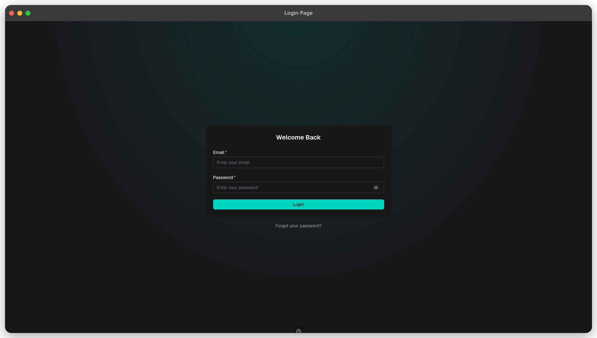
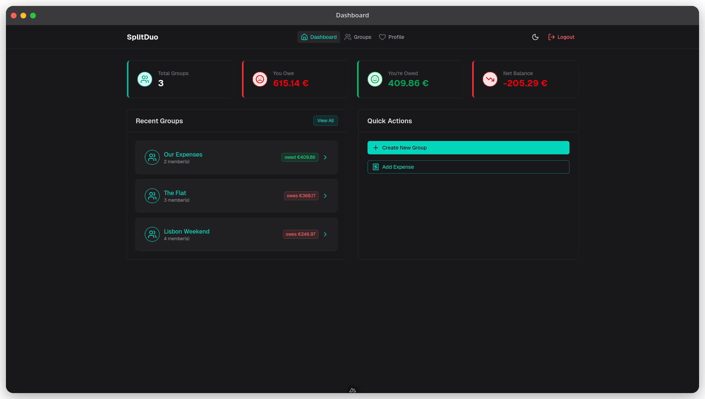
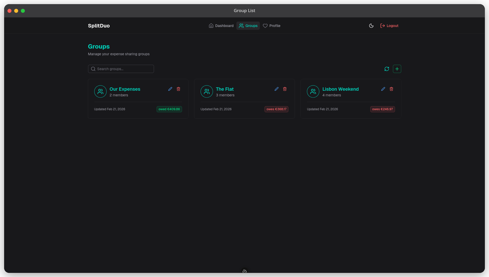
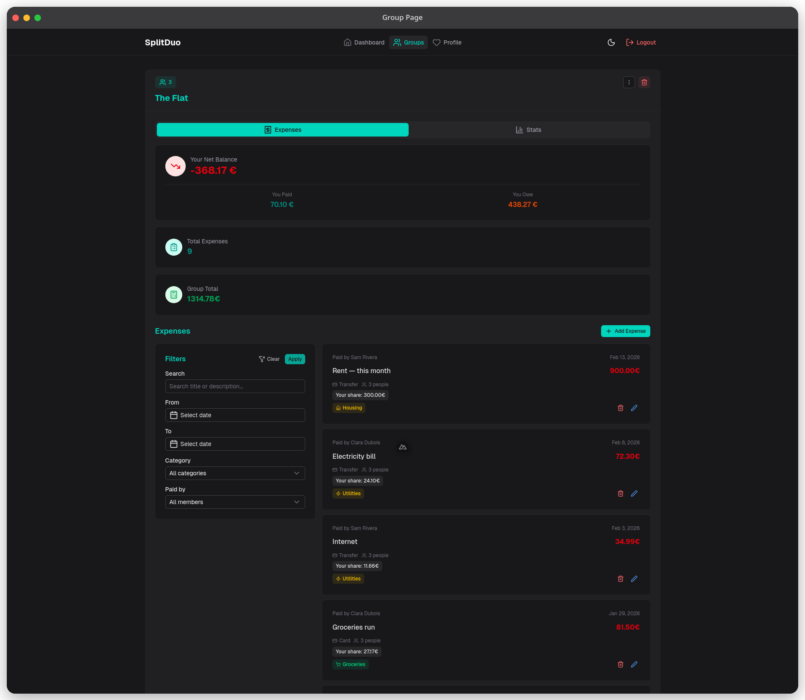
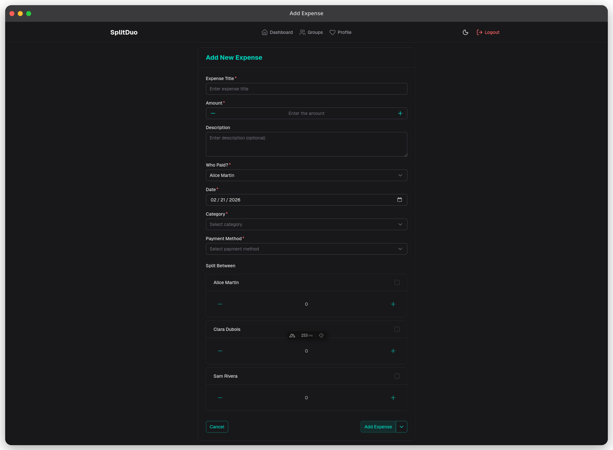

# SplitDuo

A lightweight, open-source expense splitting application designed for couples and two-person households. SplitDuo provides a simple, self-hosted alternative to existing solutions like Splitwise and Cospend.

## Screenshots











## Features

- **Two-User Focus**: Optimized for couples and partners
- **Mobile-First Design**: Responsive UI optimized for smartphones
- **Expense Tracking**: Add, edit, and manage shared expenses with automatic split calculations
- **Balance Management**: Real-time balance tracking with settlement optimization
- **Invitation System**: Invite users via email with secure token-based registration
- **Secure Authentication**: JWT-based authentication with refresh token rotation
- **Data Migration**: Import from Cospend, export to CSV
- **PWA Support**: Install on home screen for native-like experience
- **Self-Hosted**: Complete control over your data and privacy

## Tech Stack

- **Backend**: .NET 10 Web API with Entity Framework Core
- **Frontend**: Vue.js with Nuxt UI (served as static files)
- **Database**: PostgreSQL 17
- **Deployment**: Single Docker container + PostgreSQL
- **Architecture**: Multi-stage Docker build with frontend and backend combined

## Quick Start

### Prerequisites

- Docker and Docker Compose
- Git

### Installation

1. Clone the repository:

```bash
git clone https://github.com/yourusername/splitduo.git
cd splitduo
```

1. Start the application:

```bash
docker compose up -d
```

1. Access the application at `http://localhost:3000`

### Default Login

- **Email**: `admin@localhost`
- **Password**: `changeme`

**⚠️ Important**: Change the JWT secret key and admin password in production!

## Configuration

### Key Environment Variables

Edit `docker-compose.yml` or set environment variables:

**Security (Required for Production)**:

```yaml
SD_JWT_SECRET_KEY: your-super-secret-jwt-key-change-this-in-production
SD_INITIAL_USER_EMAIL: admin@splitduo.local
SD_INITIAL_USER_PASSWORD: changeme123
```

**Database**:

```yaml
SD_DB_HOST: postgres
SD_DB_NAME: splitduo
SD_DB_USERNAME: splitduo
SD_DB_PASSWORD: splitduo
```

**Application**:

```yaml
SD_BASE_URL: http://localhost:3000
SD_ENVIRONMENT: Production
```

**Email (Optional)**:

```yaml
SD_EMAIL_SMTP_HOST: localhost
SD_EMAIL_SMTP_PORT: 587
SD_EMAIL_SMTP_USERNAME: ""
SD_EMAIL_SMTP_PASSWORD: ""
SD_EMAIL_SSL: "false"
```

## Architecture

- **Single Container Deployment**: Frontend (Nuxt.js) built as static files served by .NET backend
- **Database**: Separate PostgreSQL container with health checks
- **Port Mapping**: Application runs on port 3000 (maps to container port 8080)
- **Volumes**: Persistent data storage for database and application logs
- **Networks**: Isolated Docker network for service communication

## Development

### Local Development

**Backend** (.NET 10):

```bash
cd sd-backend
dotnet restore
dotnet run --project SplitDuo.Api
```

**Frontend** (Vue.js/Nuxt):

```bash
cd sd-frontend
pnpm install
pnpm dev
```

### Dev Services (PostgreSQL + Mailpit)

```bash
./scripts/dev.sh           # Start both PostgreSQL and Mailpit
./scripts/dev.sh postgres  # PostgreSQL only
./scripts/dev.sh mailpit   # Mailpit only
./scripts/dev.sh -d        # Drop and recreate volumes before starting
```

Mailpit UI (email testing): http://localhost:8025

### Database Migrations

```bash
cd sd-backend
dotnet ef migrations add <MigrationName> --project SplitDuo.Core --startup-project SplitDuo.Api
dotnet ef database update --project SplitDuo.Core --startup-project SplitDuo.Api
```

## API

Base URL: `http://localhost:3000/api/v1`

**Core Endpoints**:

- `/auth` - Authentication (login, refresh, revoke)
- `/users` - User management
- `/groups` - Group and membership management
- `/expenses` - Expense tracking with split calculations
- `/settlements` - Payment recording between users
- `/balances` - Balance calculations and settlement suggestions

## Documentation

- [Project Specification](docs/project-spec.md)
- [System Architecture](docs/architecture/system-architecture.md)
- [Backend Architecture](docs/architecture/backend-architecture.md)
- [Frontend Architecture](docs/architecture/frontend-architecture.md)
- [Database Schema](docs/database/database-schema.dbml)
- [OpenAPI Spec](docs/api/splitduoapi-v1.yaml)

## License

MIT License
