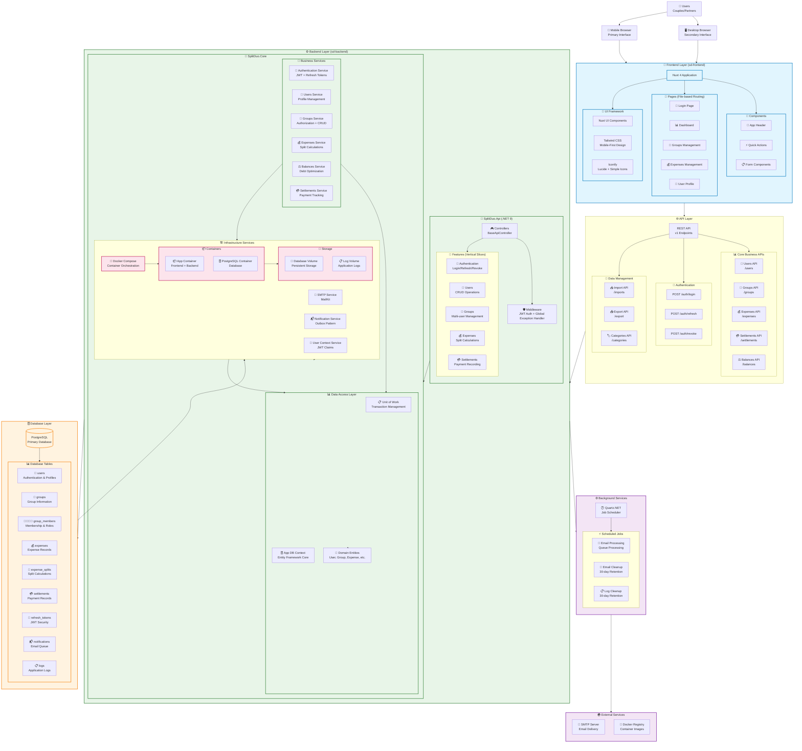

# SplitDuo System Architecture

## Architecture Overview

**SplitDuo** is a modern expense splitting application built with a **microservice-inspired monolithic architecture** using containerization for deployment simplicity.

### Key Architectural Patterns

1. **Vertical Slice Architecture** - Backend organized by features rather than technical layers
2. **Mobile-First Design** - Frontend optimized for smartphone usage
3. **Single Container Deployment** - Frontend and backend served from one container
4. **Outbox Pattern** - Reliable email notifications with background processing
5. **Enhanced Result Pattern** - Type-safe error handling with HTTP status codes
6. **JWT with Refresh Tokens** - Secure authentication with token rotation

### Technology Stack

- **Frontend**: Nuxt 4, Vue 3, Nuxt UI, Tailwind CSS
- **Backend**: .NET 9, Entity Framework Core, ASP.NET Core Web API
- **Database**: PostgreSQL with comprehensive indexing
- **Authentication**: JWT Bearer tokens with refresh token rotation
- **Background Jobs**: Quartz.NET for email processing and cleanup
- **Email**: MailKit SMTP integration with outbox pattern
- **Deployment**: Docker Compose with multi-container setup
- **Logging**: Serilog with PostgreSQL sink and console output

### Core Features Implemented

✅ **User Management** - Secure user creation and profile management
✅ **Group Management** - Multi-user groups with role-based permissions
✅ **Expense Tracking** - Complete CRUD with automatic split calculations
✅ **Balance Calculations** - Real-time debt calculation with settlement optimization
✅ **Settlement Management** - Payment recording between group members
✅ **Authentication System** - JWT with secure refresh token rotation and 2FA support
✅ **Email Notifications** - Background email processing with retry logic
✅ **Data Persistence** - PostgreSQL with comprehensive entity relationships

### Security Features

- 🔐 **JWT Authentication** with 15-minute access tokens
- 🔄 **Refresh Token Rotation** for enhanced security
- 🛡️ **Group-based Authorization** with membership validation
- 📧 **Secure Email Processing** with outbox pattern
- 🔑 **Password Hashing** using ASP.NET Core Identity
- 🚫 **No Registration Endpoint** - admin-managed user creation only
- 🛡️ **Two-Factor Authentication** - TOTP, email codes, and backup codes
- 🔒 **Cryptographic Security** - SHA256 token hashing, secure random generation
- ⏱️ **Time-based Security** - Expiring verification codes with rate limiting

### Data Flow

1. **Authentication Flow**: Login → [2FA Verification] → JWT + Refresh Token → API Access → Token Refresh/Rotation
2. **Business Operations**: Frontend → REST API → Service Layer → Unit of Work → Database
3. **Email Processing**: Business Operations → Notification Queue → Background Job → SMTP Server
4. **Balance Calculations**: Expenses + Settlements → Balance Service → Optimization Algorithm → Settlement Suggestions

### Deployment Architecture

- **Single Application Container**: Contains both frontend (Nuxt) and backend (.NET)
- **Dedicated Database Container**: PostgreSQL with persistent volumes
- **Background Processing**: Integrated Quartz.NET scheduler within application
- **Email Integration**: SMTP configuration for notification delivery
- **Log Management**: Centralized logging with 30-day retention policy

This architecture supports the initial **two-person expense splitting** use case while maintaining extensibility for future **multi-user group expansion** and additional features.
